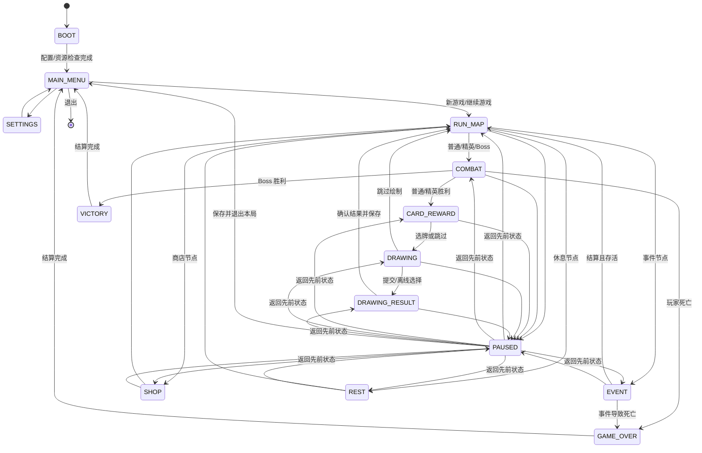

# 《墨痕登塔》游戏设计基线稿

> 文档状态：玩法扩充基线 0.2  
> 冻结范围：完整一局、核心循环、MVP 边界、状态流转、首批卡牌/敌人/绘墨印记  
> 变更规则：第 1 轮起若要改变本文冻结项，须在当轮“关键决策”中记录原因和影响。

## 1. 游戏设计简述

《墨痕登塔》（Inkbound Spire）是一款单机、单章节的 Roguelike 卡牌构筑游戏。玩家扮演“砚行者”，沿一张可预览的分支地图登塔，通过敌人意图、有限能量、牌组构筑和路线选择管理风险。每次普通或精英战斗获胜后，玩家完成一次“绘墨仪式”；识别器只把画作归入固定标签，本地规则再赋予一个有收益也有代价的“绘墨印记”。

作品的展示重点是：一局能够从菜单稳定走到 Boss 结算；绘图不是装饰，而会改变后续卡牌决策；离线识别和在线识别使用同一结果协议，未配置 API Key 仍可完整游玩。

### 1.1 玩家角色

- 角色名：砚行者。
- 初始最大生命：72；初始生命：72；初始金币：60。
- 每回合基础能量：3；基础抽牌：5；手牌上限：10。
- 初始牌组（10 张）：`ink_slash`×4、`paper_guard`×4、`wet_brush`×1、`broken_tip`×1。
- 一次只能装备 1 个当前绘墨印记；取得新印记时替换旧印记。替换前必须展示新旧效果并确认。由题签启用的“并印”只会让旧印记正面被动额外持续一场，不占第二印记槽。

### 1.2 单章结构

- 一章共 9 层，每层只能访问一个节点。
- 第 1 层固定普通战斗，第 4 层固定精英，第 8 层固定休息，第 9 层固定 Boss。
- 第 2、3、5、6、7 层由普通战斗、事件、商店、休息按模板生成；相邻层之间形成 2～3 条可选路线。
- 同一路线不得连续出现两个商店；进入商店前至少能获得一次金币；Boss 前必须存在一次休息机会。
- 地图在新旅程时由种子一次性生成并写入存档；重新加载不会重掷节点或连接。

## 2. 核心循环与完整一局

1. 从主菜单创建旅程或载入有效存档。
2. 新旅程记录随机种子，生成 9 层地图和初始 `RunState`。
3. 玩家在当前可达节点中选择一个节点。
4. 节点结算：
   - 普通/精英/Boss：进入回合制战斗；
   - 事件：在 2～3 个带明确代价的选项中选择；
   - 休息：在治疗与删牌之间二选一；
   - 商店：购买卡牌或删牌，也可直接离开。
5. 普通或精英战斗胜利后，先领取卡牌/金币奖励，再进入绘墨仪式；可跳过绘制。
6. 绘图提交后由离线 Mock 或可选在线识别器返回固定标签候选；本地映射并确认印记。
7. 返回地图并自动保存，继续选择下一节点。
8. 玩家生命降至 0 时进入失败结算；击败第 9 层 Boss 时进入胜利结算。
9. 结算展示层数、击败数、获得卡牌、绘图次数/结果与用时；结束本局后清除局内存档，保留设置、最佳成绩与图鉴解锁。

### 2.1 战斗循环

1. 创建本场战斗牌堆，应用战斗开始效果，生成并显示敌人意图。
2. 玩家回合开始：处理回合开始效果、恢复能量、抽牌。
3. 玩家点击或拖动卡牌，选择合法目标并支付能量，依次结算卡牌效果。
4. 玩家主动结束回合或无牌可打；处理玩家回合结束效果并弃置非保留手牌。
5. 存活敌人按从左到右顺序执行已公开意图，然后生成下一回合意图。
6. 玩家或全部敌人死亡时立即停止未开始的后续行动，进入胜负流程；否则回到步骤 2。

### 2.2 战后流程

- 普通战：基础 18～26 金币，展示 3 张卡牌选择 1 张或跳过，然后绘墨。
- 精英战：基础 35～48 金币，展示 3 张卡牌且稀有权重提高，然后绘墨。
- Boss 战：直接进入胜利结算，不触发强惩罚彩蛋；MVP 不再发放影响后续战斗的奖励。
- 烈焰印记的战后扣血在胜利确认后、奖励界面前执行，最低保留 1 点生命。

## 3. MVP 范围冻结

### 3.1 必须完成

- 单角色、单初始牌组、50 张原创卡牌；全部属于统一角色牌池，两条协同轴不是互斥职业。
- 8 种普通敌人、2 种精英敌人、1 个 Boss。
- 9 层单章分支地图；普通、精英、事件、休息、商店、Boss 六类节点。
- 3 个随机事件、一个简化商店模型、完整胜利与失败结算。
- 6 个双刃绘墨印记、离线 Mock 识别、可选在线 LLM 识别、安全降级和彩蛋限制。
- 主菜单、设置、暂停、图鉴只读页、制作人员页、存档和继续游戏。
- 键鼠全流程、基础手柄焦点导航、单指触控到鼠标映射。
- Windows 可执行版本；源码可在 Windows/macOS/Linux 上运行。

### 3.2 明确不做

- 多角色、多章节、永久属性养成、每日挑战。
- 联网排行、多人、账号、云存档。
- Mod、卡牌编辑器、关卡编辑器。
- AI 生成卡牌、敌人、数值、BUFF 或剧情结果。
- 复杂骨骼动画、重粒子、配音、多指手势。
- 在线识别所必需的账号代管或 API Key 持久化。

### 3.3 时间不足时的保留顺序

1. 完整一局与存档安全。
2. 可测试的战斗规则。
3. 离线绘墨流程与六种印记。
4. 地图、事件、商店和路线风险。
5. 在线识别。
6. 手柄、美术替换和音频润色。

不允许通过删除离线模式、最终 Boss、失败结算或绘墨流程来换取更多卡牌与表现效果。

## 4. 状态流转图

### 4.1 状态约束

- `BOOT` 只负责初始化和可恢复错误，不承载菜单逻辑。
- `PAUSED` 保存一个 `return_state`，不复制被暂停状态的数据；Boss 结算页不允许暂停。
- `DRAWING` 提交后仍保持可渲染；识别结果携带请求 ID。只有请求 ID 与当前状态均匹配时才能进入 `DRAWING_RESULT`。
- 取消识别会让结果失效并返回可编辑画布；迟到的后台回调只能被丢弃。
- 所有局内数据归 `RunState`；页面控件仅展示或发出命令。
- 状态切换由统一状态机在当前帧更新结束后执行，避免输入处理中途替换状态。

## 5. 卡牌原型与扩充清单

> 下表保留最初 24 张原型用于设计追踪；实现以 `character_combat_expansion.md` 第 1～3 节冻结的 50 张统一牌池为准。

关键词：`消散`表示本场战斗移出；`保留`表示回合结束不弃置；`丢弃`由玩家选择时必须有合法手牌；所有未注明目标的格挡/抽牌作用于玩家。

| ID                | 名称   | 类型/稀有度 | 费用 | 冻结效果                                                | 初始 |
| ----------------- | ------ | ----------- | ---: | ------------------------------------------------------- | :--: |
| `ink_slash`       | 泼墨斩 | 攻击/基础   |    1 | 造成 6 点伤害                                           |  ×4  |
| `paper_guard`     | 宣纸护 | 技能/基础   |    1 | 获得 5 点格挡                                           |  ×4  |
| `wet_brush`       | 润笔   | 技能/基础   |    1 | 抽 2 张牌                                               |  ×1  |
| `broken_tip`      | 断锋   | 攻击/基础   |    2 | 造成 11 点伤害                                          |  ×1  |
| `flying_white`    | 飞白   | 攻击/普通   |    1 | 造成 7 点伤害；若本回合已打出技能牌，再获得 3 点格挡    |      |
| `reverse_stroke`  | 逆锋   | 攻击/普通   |    1 | 造成 5 点伤害；将 1 张手牌置入抽牌堆顶                  |      |
| `ink_splash`      | 溅墨   | 攻击/普通   |    1 | 对所有敌人造成 5 点伤害                                 |      |
| `pressing_stroke` | 顿笔   | 攻击/普通   |    2 | 造成 14 点伤害；下回合少抽 1 张牌                       |      |
| `seal_breaker`    | 破印   | 攻击/罕见   |    2 | 造成 10 点伤害；目标有格挡时额外造成 6 点伤害           |      |
| `echoing_edge`    | 回锋   | 攻击/罕见   |    1 | 造成 4 点伤害；若这是本回合第 3 张牌，再造成 8 点伤害   |      |
| `soot_line`       | 焦墨线 | 攻击/罕见   |    2 | 造成 12 点伤害；敌人本回合攻击伤害降低 3                |      |
| `last_glyph`      | 末字   | 攻击/稀有   |    3 | 造成 24 点伤害；消散                                    |      |
| `folded_screen`   | 折屏   | 技能/普通   |    1 | 获得 7 点格挡；保留                                     |      |
| `wash_away`       | 洗砚   | 技能/普通   |    0 | 丢弃 1 张牌，然后抽 1 张牌                              |      |
| `paper_bridge`    | 纸桥   | 技能/普通   |    1 | 获得 4 点格挡；下一张攻击牌费用减少 1                   |      |
| `steady_wrist`    | 定腕   | 技能/普通   |    1 | 获得 5 点格挡；下回合额外获得 1 点能量                  |      |
| `copybook`        | 临帖   | 技能/普通   |    1 | 抽 1 张牌；复制本回合上一张非临帖卡到手牌，复制品消散   |      |
| `drying_rack`     | 晾纸   | 技能/罕见   |    1 | 选择 1 张手牌保留；获得 6 点格挡                        |      |
| `ink_reserve`     | 蓄墨   | 技能/罕见   |    0 | 下回合额外获得 2 点能量；本回合结束时失去 3 点格挡      |      |
| `blank_space`     | 留白   | 技能/罕见   |    1 | 本回合若不再出牌，回合结束获得 12 点格挡                |      |
| `seal_script`     | 篆护   | 技能/稀有   |    2 | 获得 14 点格挡；消散                                    |      |
| `one_breath`      | 一气   | 技能/稀有   |    1 | 抽 3 张牌；本回合不能再获得能量；消散                   |      |
| `ink_return`      | 墨归   | 技能/稀有   |    1 | 从弃牌堆选择 1 张攻击牌放入手牌；该牌本回合费用 +1      |      |
| `quiet_studio`    | 静室   | 技能/稀有   |    2 | 获得 8 点格挡；下回合多抽 2 张牌；消散                  |      |

### 5.1 卡池约束

- 奖励不会出现基础稀有度卡牌；普通/罕见/稀有的基础权重为 60/32/8，精英奖励为 45/40/15，并应用扩充稿定义的稀有补偿值。
- 每个卡位从完整角色牌池按稀有度独立抽取；同一奖励中的 3 张卡牌 ID 不重复，不按塑印/行气标签分池或修正概率；牌组不设硬上限。
- 卡牌升级、药水与遗物不属于 MVP，避免与绘墨印记争夺系统注意力。
- 第一版所有卡牌仅使用本文明确的效果原语；不加入未设计的中毒、脆弱、力量等独立状态系统。

## 6. 敌人原型与扩充清单

> 下表保留最初敌人原型用于设计追踪；实现以 `character_combat_expansion.md` 第 4～6 节冻结的 8 种普通敌人、2 种精英和 1 个 Boss 为准。

数值为初版调参基线，敌人每回合在行动前公开意图。随机分支只使用本场战斗保存的 RNG。

| ID                    | 名称     | 类别 | 生命 | 行动模式                                                                                                                                      |
| --------------------- | -------- | ---- | ---: | --------------------------------------------------------------------------------------------------------------------------------------------- |
| `paper_wraith`        | 纸魇     | 普通 |   28 | 循环：攻击 7 → 获得 6 格挡 → 攻击 9                                                                                                           |
| `inkstone_bandit`     | 砚盗     | 普通 |   34 | 循环：攻击 6 并使玩家下回合少抽 1 → 攻击 10 → 获得 5 格挡                                                                                     |
| `ash_lantern_moth`    | 灰灯蛾   | 普通 |   24 | 循环：全体攻击 5 → 蓄势 → 攻击 13；蓄势回合不造成伤害                                                                                         |
| `broken_brush_puppet` | 断笔傀   | 普通 |   42 | 在“攻击 8”和“获得 7 格挡后攻击 4”间交替                                                                                                       |
| `vermilion_bailiff`   | 朱印执吏 | 精英 |   78 | 每 3 回合盖印：攻击 12 → 获得 10 格挡 → 攻击 16；第 2 轮起攻击永久 +1，最多 +4                                                                |
| `mirror_beast`        | 反字镜兽 | 精英 |   70 | 循环：攻击 9 → 获得等于玩家上回合获得格挡量一半的格挡（向下取整）并攻击 6 → 攻击 15                                                           |
| `wordless_stele`      | 无字碑主 | Boss |  168 | 两阶段；生命高于 50%：攻击 10 → 格挡 12 → 攻击 14。降至 50% 或以下后立即清除自身格挡并切换：攻击 8×2 → 格挡 10 且使玩家下回合少抽 1 → 攻击 22 |

### 6.1 敌人约束

- 敌人死亡后不再行动；同一效果击杀目标后，对该目标的未开始后续效果跳过。
- 敌人攻击加值只修改攻击伤害，不修改格挡或抽牌惩罚。
- Boss 阶段切换每场仅一次，在导致其生命跨过阈值的完整卡牌结算后发生，不打断一张卡牌。
- 普通战为 1～2 个普通敌人；精英和 Boss 均为单体，以控制首版 UI 与规则复杂度。

## 7. 六种绘墨印记

> 下表定义基础被动；印辉、流辉、护印、题签与并印等扩充交互以 `character_combat_expansion.md` 第 2 节及 `balance_rules.md` 为准。

| ID             | 标签                   | 名称     | 正面效果                                                          | 负面效果                                                                               |
| -------------- | ---------------------- | -------- | ----------------------------------------------------------------- | -------------------------------------------------------------------------------------- |
| `ink_mark`     | `ink`, `drop`, `paint` | 墨水印记 | 每回合实际打出的前 2 张技能牌费用 -1，最低 0                      | 攻击牌每个伤害效果的基础值 -1，最低 0                                                  |
| `flame_mark`   | `flame`, `fire`        | 烈焰印记 | 攻击牌每个伤害效果的基础值 +2                                     | 战斗胜利后失去 3 当前生命，最低保留 1                                                  |
| `armor_mark`   | `shield`, `armor`      | 盾甲印记 | 战斗开始时获得 8 格挡                                             | 第一回合基础抽牌 -1                                                                    |
| `insight_eye`  | `eye`, `insight`       | 洞察之眼 | 第一回合基础抽牌 +2                                               | 每名敌人第一回合攻击伤害 +1                                                            |
| `eclipse_mark` | `moon`, `eclipse`      | 月蚀印记 | 当前生命严格低于最大生命 40% 时，攻击最终面板伤害 ×1.25，向下取整 | 当前生命严格大于最大生命 40% 时，攻击最终面板伤害 ×0.8，向下取整                       |
| `chaos_spiral` | `spiral`, `vortex`     | 混沌漩涡 | 每打出第 4 张牌，免费再次触发该牌的主要效果一次                   | 同回合第 2 次及以后触发时随机消散 1 张牌；无手牌时从抽牌堆或弃牌堆随机选择              |

### 7.1 识别与弱结果

- `confidence >= 0.78`：直接展示对应印记，玩家确认后替换。
- `0.50 <= confidence < 0.78`：展示最多 3 个合法候选，玩家选择其一或跳过。
- `confidence < 0.50` 且认真绘制：从 3 个固定“未定灵感”弱效果中选择其一；弱效果持续到下一场战斗结束，不占用长期印记槽。
- `confidence < 0.50` 且本地判定低投入：首次失败仍不给强惩罚；之后才进入 8% 彩蛋抽取。
- 在线返回未知标签、非 JSON、超时或认证失败均视为识别失败，并转入同一离线候选流程，不丢失画布或进度。
- 玩家可在提交前跳过绘墨；跳过不算识别失败，也不触发彩蛋。

固定的 3 个弱效果：`faint_edge`（下一战第一张攻击 +2 伤害）、`faint_guard`（下一战开始 +3 格挡）、`faint_focus`（下一战第一回合多抽 1，第二回合少抽 1）。

## 8. 三个随机事件与节点基线

| ID                    | 名称     | 选项                                                                             |
| --------------------- | -------- | -------------------------------------------------------------------------------- |
| `rain_on_xuan`        | 宣纸夜雨 | 失去 6 当前生命并从 3 张罕见卡中选 1；或获得 18 金币并离开                       |
| `nameless_copybook`   | 无名残帖 | 删除 1 张牌并失去 25 金币；或复制 1 张非稀有牌并失去 8 生命；或离开              |
| `sleeping_ink_spirit` | 沉睡墨灵 | 献出 12 金币，下一场开始获得 7 格挡；或惊醒它，50% 获得 30 金币、50% 失去 9 生命 |

- 事件生命损失可导致失败，但选择按钮必须显示预计结果。
- 休息：治疗最大生命的 30%，向下取整；或删除 1 张非最后副本的卡牌。月蚀只修正治疗选项。
- 商店：展示 5 张不重复卡牌；价格普通 45、罕见 75、稀有 120；删牌基础 65，每次购买删牌服务后本局价格 +25。离开商店不收费。

## 9. 验收时的一局样例

固定种子应能复现以下性质，而不要求节点名称完全等同：新游戏进入普通战；胜利选牌；离线绘图获得一个候选印记；地图出现至少一次路线分叉；第 4 层进入精英；第 8 层可休息；第 9 层进入无字碑主；Boss 胜利进入统计页并清除局内存档。任意途中生命归零则进入失败统计页，程序仍可返回主菜单开始新局。
